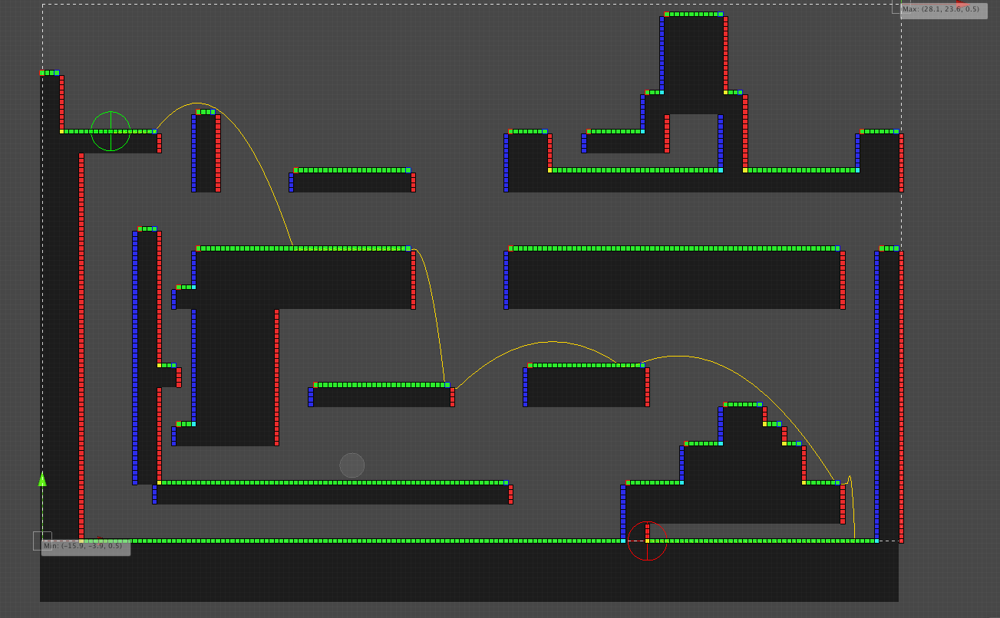

# Shiroi2DPathfinding
## 2D Pathfinding solution for Unity

Shiroi 2D Pathfinding is a framework for platformer pathfinding.
# Work it works
There are two major components:
* Navigation Meshes (NavMesh2D)
* Link Maps (LinkMap2D)

A NavMesh holds information about the world geometry, and what is solid or not.

A LinkMap holds information about how to navigate a NavMesh, and how two nodes in NavMesh might be connected (through a Link)   

*TODO: Complete*
# Dependencies
S2D includes a DLL from [Tsuki](https://github.com/LunariStudios/TsukiSuite/) (version 2.1.0), which is a utility library for Unity.  
However, you do not need to download anything, since everything's already included
# Architecture
S2D is very modular, we did this because we understand different games have different requirements.  

The way it works is:  
 
There is a basic, generic library, that must be extended with the data layout that you want to use.

This "extension" is called an implementation.

We provide a built in implementation called "Kuroi", which provides support for tile based, 2D platformers.  

However, if you want to customize your data layout to be more on par with your 
requirements, you are very encouraged to do so!

*TODO: More doc*